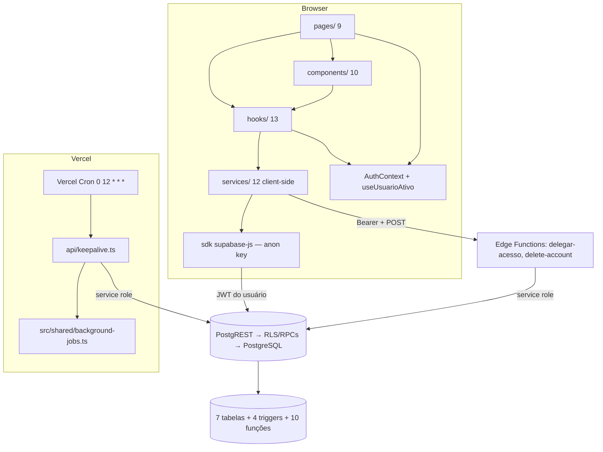

# Architecture Overview — MeuFenil

**Última verificação:** 2026-08-13 (commit 6323664)

Índice ARQUITETURAL de alto nível (o índice FUNCIONAL é o [system-map](../system-map.md)). Este documento aponta para as specs especializadas — não duplica conteúdo. Decisões arquiteturais: [decisions](../../decisions/).

## Visão geral

MeuFenil é uma **SPA sem servidor de aplicação próprio**: o frontend (React 19 + Vite) fala diretamente com o Supabase (PostgREST + Auth + Edge Functions); a única peça server-side própria é a função Vercel `api/keepalive` (cron diário); ferramentas de operação rodam localmente (CLI + script de migrations) `[CONFIRMED: código — ../backend/overview.md]`.

## Arquitetura em camadas

Todas as arestas do diagrama são confirmadas por código/configuração `[CONFIRMED: code — Fases 4–5]`.

## Frontend

- SPA React 19 + TypeScript strict + Vite + Tailwind (config padrão, sem tokens customizados) + React Router 7 + Recharts + lucide + date-fns(-tz) — [frontend/overview](../frontend/overview.md).
- Camadas internas: pages → hooks (1 por página) → services (client-side, anon) → `lib/supabase`; DTOs simples espelhando snake_case; erros `AppError`+`logger`; loading por skeletons `[CONFIRMED: code]`.
- Autorização de UI é controle de EXPERIÊNCIA (o enforcement é do banco) — [security/security-model](../security/security-model.md).

## Backend

- Sem servidor de aplicação: lógica server-side distribuída entre RPCs do banco (PostgREST), 2 Edge Functions (Deno, service role + validação de Bearer) e 1 função Vercel (keepalive) — [backend/overview](../backend/overview.md).
- RPCs de negócio: `ativar_referencia`, `remover_ou_desativar_referencia`, `get_estatisticas_admin`; RPCs órfãs: `dashboard_hoje`/`dashboard_ultimos_dias` — [database/rpc](../database/rpc.md).
- Operação: CLI (5 comandos) e `apply-supabase-migrations.sh` — [backend/cli](../backend/cli.md).

## Database

- PostgreSQL Supabase: 7 tabelas, RLS em TODAS, 31 políticas, 10 funções, 4 triggers; 2 tabelas + 1 coluna + ~20 políticas SEM DDL versionado (fato — [database/overview](../database/overview.md)).

## Authentication / Authorization

- Google OAuth via Supabase Auth; identidade = `auth.uid()`; perfil criado por trigger; login-as NÃO troca token — [security/security-model](../security/security-model.md) seções 1–2, 9.

## Integrations

Supabase (BaaS) · Google OAuth · Vercel (cron/hosting) · ANVISA (seed de dados) · GitHub (apenas repositório, sem CI) — [product/overview](../product/overview.md).

## Deployment / Environments

- Vercel (SPA + cron); 2 ambientes Supabase (dev/prod) com estrutura lógica idêntica; diferenças físicas registradas (pg_graphql dev-only; coluna dropped prod) — [database/overview](../database/overview.md), [security/secrets-and-environments](../security/secrets-and-environments.md).

## Testing

Vitest + Testing Library (jsdom), testes colocalizados; suítes de segurança com JWTs reais contra o banco dev; sem E2E/smoke/CI — [testing/testing-strategy](../testing/testing-strategy.md).

## Background jobs

Keepalive (cron) → ping service role → persistência em `background_job_executions` → retenção 365d (trigger) → monitoramento admin-only — [backend/api-keepalive](../backend/api-keepalive.md), [backend/background-jobs](../backend/background-jobs.md).

## Runtime boundaries (fronteiras reais)

| Fronteira | Natureza | Enforcement |
|---|---|---|
| Browser × servidor | sem app server — tudo server-side é BaaS/edge | — |
| Não autenticado × autenticado | RLS (anon vê só referências globais) | banco |
| Usuário × Admin | `usuarios.role` + `is_admin_user`/claim JWT | banco + gate de UI |
| Dono × Delegado | `delegacoes_acesso` ativa | banco (15 policies + 2 RPCs) |
| anon/authenticated × service_role | bypass de RLS apenas server-side (edge/keepalive) | segredo service role fora do browser |
| Supabase × Vercel | keepalive Vercel → Supabase via service role | envs Vercel |
| DEV × PROD | bancos distintos; keepalive por ambiente; labels `dev`/`prod` | envs |

## Data flows (resumo — detalhe nas specs de feature)

| Fluxo | Caminho | Spec |
|---|---|---|
| Authentication | Browser → Supabase Auth (OAuth) → trigger cria perfil | [FEAT-0001](../features/FEAT-0001-autenticacao.md) |
| Registro de consumo | UI calcula fenil → PostgREST INSERT (RLS dono/delegado + referência ativa) | [FEAT-0003](../features/FEAT-0003-registro-diario-consumo.md) |
| Referências | UI → PostgREST (CRUD) / RPCs (ativar/remover) | [FEAT-0008](../features/FEAT-0008-referencias-alimentares.md) |
| Exames | UI → PostgREST (RLS dono/delegado) | [FEAT-0009](../features/FEAT-0009-exames-pku.md) |
| Delegação | UI → edge function (Bearer + service role) → delegacoes_acesso; autorização por RLS | [FEAT-0011](../features/FEAT-0011-delegacao-acesso.md) |
| Admin | UI → PostgREST/RPC (get_estatisticas_admin) | [FEAT-0012](../features/FEAT-0012-painel-administrativo.md) |
| Keepalive | Vercel Cron → service role → ping + persistência | [FEAT-0013](../features/FEAT-0013-background-jobs.md) |
| Exclusão de conta | UI → edge function (registros → usuarios → auth) | [FEAT-0010](../features/FEAT-0010-perfil-usuario.md) |

## Architectural patterns (observados)

> "Padrão observado" NÃO significa decisão formal registrada. Decisões com ADR estão em [decisions](../../decisions/).

1. **SPA + BaaS** — cliente fala direto com Supabase; sem app server (ADR-0001, ADR-0008).
2. **Camadas hooks→services** — hooks de dados por página; services finos com DTOs; erros codificados (AppError).
3. **RLS como fronteira de autorização** — grants amplos; enforcement em policies/RPCs (ADR-0004).
4. **RPC SECURITY DEFINER para operações sensíveis** — com verificação interna de dono/delegado/admin (ADR-0010).
5. **Soft delete via coluna de estado** — `referencias.is_ativa` + RPC + trigger de limpeza (ADR-0006).
6. **Delegação sem troca de identidade** — login-as é estado de UI; banco autoriza por tabela de delegação (ADR-0005).
7. **Background job com persistência própria** — tabela dedicada + retenção por trigger (ADR-0007).
8. **Segurança testada com autenticação real** — Abordagem B (ADR-0011).

## Evidências

- E1 — Todas as afirmações deste documento derivam das specs das Fases 2–8 (links acima) `[CONFIRMED: specs]`
- E2 — Diagrama validado contra código/configurações (Fases 4–5) `[CONFIRMED: code]`

## Veja também

- [../system-map.md](../system-map.md) (índice funcional), [decisions](../../decisions/) (ADRs), [../testing/testing-strategy.md](../testing/testing-strategy.md)
