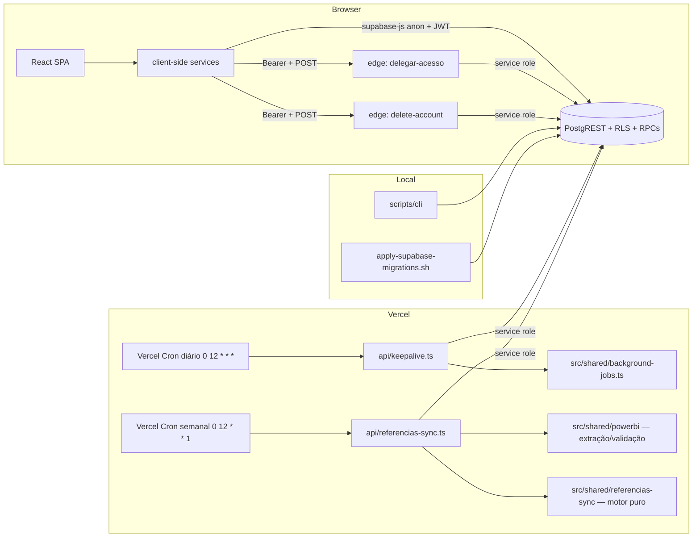

# Backend — Visão Geral

**Última verificação:** 2026-09-07 (FEAT-0017 M6 — seed `pre_sync_inativa` no estágio 7 (CREATE OR REPLACE da `aplicar_sync_referencias`) e UI do Admin M6 chamando curadoria/recuperação; prod segue pré-ENH-0004 até a release)

## Propósito

Documenta a arquitetura REAL do backend do MeuFenil: componentes server-side, onde executam, quem os chama, como acessam dados e como se relacionam com o frontend e o banco. O MeuFenil **não possui servidor de aplicação próprio** — o "backend" é composto por peças distribuídas (função Vercel, edge functions Supabase, lógica no banco via RPCs/triggers e ferramentas de linha de comando).

## Inventário de componentes

`[CONFIRMED: filesystem — inventário 2026-08-13]`

| Componente | Onde executa | Quem chama | Acesso privilegiado | Spec |
|---|---|---|---|---|
| `api/keepalive.ts` | Vercel (serverless, Node) | Vercel Cron (diário, `0 12 * * *`) | service role (2 ambientes definidos em env; 1 alvo por execução) | [api-keepalive.md](api-keepalive.md) |
| `api/referencias-sync.ts` | Vercel (serverless, Node) | Vercel Cron (semanal, `0 12 * * 1`) + POST manual (admin) | service role dedicada (`REFERENCIAS_SYNC_*`; alvo único `prod`) | [api-referencias-sync.md](api-referencias-sync.md) |
| `supabase/functions/delegar-acesso` | Supabase Edge (Deno) | frontend (`delegacoesAcesso.service.ts`) | service role + validação do Bearer token | [edge-function-delegar-acesso.md](edge-function-delegar-acesso.md) |
| `supabase/functions/delete-account` | Supabase Edge (Deno) | frontend (página Perfil) | service role + validação do Bearer token | [edge-function-delete-account.md](edge-function-delete-account.md) |
| `src/shared/background-jobs.ts` | Vercel (helper importado pelo keepalive) | `api/keepalive.ts` | usa o client passado (service role) | [background-jobs.md](background-jobs.md) |
| `src/shared/powerbi/` (5 módulos) | Vercel (helpers importados pela rota) | `api/referencias-sync.ts` | resource key de env (`POWERBI_RESOURCE_KEY`) | [api-referencias-sync.md](api-referencias-sync.md) |
| `src/shared/referencias-sync/` (4 módulos — `canonical.ts`, `compare.ts`, `engine.ts`, `types.ts`) | Vercel (helpers importados pela rota — motor puro, sem banco) | `api/referencias-sync.ts` | nenhum (motor puro) | [api-referencias-sync.md](api-referencias-sync.md) |
| `scripts/cli/` (5 comandos) | máquina local (Node ESM) | desenvolvedor | anon/JWT do `.cli-token` ou service role (`--service-role --i-understand-rls`) ou conexão pg direta (`run-sql`) | [cli.md](cli.md) |
| `scripts/apply-supabase-migrations.sh` | máquina local (bash + Supabase CLI) | desenvolvedor | `supabase link`/`db push` com senha extraída de `SUPABASE_DATABASE_URL` | [cli.md](cli.md) |
| Funções do banco em `public` (dev pós-FEAT-0017 M1–M6: 15 — 8 pós-ENH-0004 + 2 de trigger do M1 + 2 RPCs do M4 + 3 do M5: helper `pode_operar_recuperacao` + RPCs `reverter_sync_referencias`/`restaurar_referencias_de_backup`; M6 não adiciona funções — seed é CREATE OR REPLACE da `aplicar_sync_referencias`; prod: 10 pré-ENH-0004 até a release) | PostgreSQL (PostgREST) | frontend (`referencias.service`, `admin.service`, `referencias-sync.service` — UI do Admin M6: `decidir_pendencia_referencia`/`reverter_sync_referencias`/`restaurar_referencias_de_backup`), rota de sync (`aplicar_sync_referencias` — service role) e policies | SECURITY DEFINER (15/15 em dev) | [../database/rpc.md](../database/rpc.md) |
| Triggers do banco (dev pós-FEAT-0017 M1: 4 — 3 em `public` + 1 em `auth.users`; prod: 4 até a release — pré-ENH-0004: 3 em `public` + 1 em `auth.users`) | PostgreSQL | eventos de INSERT/UPDATE | conforme a função (definer/invoker) | [../database/triggers.md](../database/triggers.md) |
| PostgREST + Supabase Auth | Supabase (BaaS) | frontend (via `supabase-js`) | anon key + JWT do usuário | [../security/security-model.md](../security/security-model.md) |

**Serviços em `src/react-app/services/` NÃO são backend:** executam no browser com o cliente anon e serão documentados na Fase 5 (frontend). A exceção é `delegacoesAcesso.service.ts`, que é um **chamador client-side** da edge function — documentado na spec da edge function, não aqui `[CONFIRMED: code]`.

## Arquitetura de execução

Cada componente, seu mecanismo de execução e sua credencial estão na tabela de inventário acima (todas as arestas do diagrama são confirmadas por código) `[CONFIRMED: code]`.

## Fronteiras de comunicação

- **Frontend → banco:** via PostgREST com anon key + JWT do usuário; autorização integralmente no banco (RLS/RPCs) `[CONFIRMED: code, database]`.
- **Frontend → edge functions:** POST com `Authorization: Bearer <access_token>`; as funções validam o token com `auth.getUser` `[CONFIRMED: code]`.
- **Vercel → banco:** service role em conexão direta `supabase-js` `[CONFIRMED: code]`.
- **CLI → banco:** três modos — cliente Supabase (anon/JWT), cliente Supabase (service role com flags explícitas) e conexão PostgreSQL direta (`run-sql`) `[CONFIRMED: code]`.

## RPCs como backend

As RPCs concentram a lógica de negócio que o frontend não deve executar (autorização e efeitos atômicos):

| RPC | Papel no backend | Chamadores |
|---|---|---|
| `ativar_referencia` / `remover_ou_desativar_referencia` | ativação/remoção com autorização dono/delegado/admin; pessoais: soft/hard pelo vínculo; GLOBAIS: sempre arquivadas, nunca exclusão física (definição 20260904000000, ENH-0004) | `referencias.service.ts:246,323-338` `[CONFIRMED: code]` |
| `get_estatisticas_admin` | agregados globais para o painel admin | `admin.service.ts:75` `[CONFIRMED: code]` |
| `is_admin_user` | apoio de autorização (policies + RPCs) | banco `[CONFIRMED: database]` |
| `dashboard_hoje` / `dashboard_ultimos_dias` | agregações de dashboard — **sem chamadores no código atual** (o dashboard/estatísticas agregam no CLIENTE via `dashboard.service`/`estatisticas.service`) `[CONFIRMED: code — ausência de chamadores]` |
| funções de trigger | lógica automática no banco — restantes: perfil no sign-up (`handle_new_user`) e retenção de jobs (`fn_trim_background_job_executions`); as de normalização de nome e limpeza de favoritos foram ELIMINADAS na ENH-0004 (dev; prod até a release) | triggers `[CONFIRMED: database, migration]` |

Detalhes (assinaturas, definers, efeitos): [../database/rpc.md](../database/rpc.md) — não duplicados aqui.

## Tratamento de erros (padrões reais)

Não há um padrão único — cada componente tem seu próprio estilo, documentado como fato:

| Componente | Padrão observado | Evidência |
|---|---|---|
| Services client-side | `AppError` com código simbólico (ex.: `REGISTRO_CREATE_ERROR`) + mensagem + causa; `logger.error` nos hooks | `src/react-app/lib/errors.ts`, `services/*` |
| `delegar-acesso` | JSON `{ error }` com status HTTP (400/401/403/404/405/500); catch genérico → 500 "Erro interno" | `supabase/functions/delegar-acesso/index.ts` |
| `delete-account` | JSON `{ error, details }` com status (401/500); catch genérico → 500 com `err.message` | `supabase/functions/delete-account/index.ts` |
| `api/keepalive.ts` | 405 para método inválido; 200 ok / 500 falha no ping; persistência de log NÃO bloqueia a resposta; `console.info`/`console.error` com prefixo `[keepalive]` | `api/keepalive.ts` |
| `api/referencias-sync.ts` | 401 (cron) / 403 (manual) / 405 / 409 (single-flight) / 500; respostas `{ sync_id, status }`; falha vira sync `failure` com evento do estágio; origem inválida vira `origin_invalid` (200); `console.*` com prefixo `[referencias-sync]` | `api/referencias-sync.ts` |
| `background-jobs.ts` | lança `Error(message)` quando o INSERT falha | `src/shared/background-jobs.ts:34-37` |
| CLI | lança erros com mensagem pt-BR; `index.js` captura e imprime `[cli] erro:` com `exitCode = 1` | `scripts/cli/index.js`, `commands/*` |

## Observabilidade (o que existe)

- **Logs de execução:** `console.info`/`console.error` no keepalive (com timings em ms), `console.error` nas edge functions e logs com prefixo `[referencias-sync]` na rota de sincronização (tempos por estágio em `details.estagios[]`) `[CONFIRMED: code]`.
- **Persistência de execuções:** cada execução do keepalive é gravada em `public.background_job_executions` com `job_key`, `environment`, `run_id`, status e `details` (ver [background-jobs.md](background-jobs.md) e [../database/background_job_executions.md](../database/background_job_executions.md)) `[CONFIRMED: code, database]`.
- **Consulta das execuções:** painel admin (`useBackgroundJobsAdmin`) com filtros por job/status/período — leitura client-side (Fase 5) `[CONFIRMED: code]`.
- **Retenção:** trigger remove execuções com mais de 365 dias `[CONFIRMED: migration — ../database/triggers.md]`.
- **Não existe:** error reporting service, tracing, métricas ou monitoramento além do acima `[CONFIRMED: ausência — filesystem e código]`. Logs das plataformas (Vercel/Supabase dashboards) não são verificáveis pelo repositório (`UNKNOWN`).

## Configuração

- `vercel.json`: crons `/api/keepalive` (diário, `0 12 * * *`) e `/api/referencias-sync` (semanal, `0 12 * * 1`) + rewrite SPA `[CONFIRMED: configuration]`.
- `supabase/config.toml`: apenas `[functions.delete-account]` (`enabled`, `verify_jwt = true`, import_map); `delegar-acesso` NÃO declarada `[CONFIRMED: configuration]`.
- Variáveis de ambiente: inventário completo em [../security/secrets-and-environments.md](../security/secrets-and-environments.md) — não duplicado aqui.

## Testes de backend

| Teste | Componente | Tipo | Evidência |
|---|---|---|---|
| `api/keepalive.test.ts` | keepalive | unitário com mocks (`createClient`, `recordBackgroundJobExecution`) — 4 cenários: env prod, env dev, persistência falha não bloqueia, erro principal → 500 | `api/keepalive.test.ts` |
| `api/referencias-sync.test.ts` | rota de sincronização | unitário com mocks (`createClient`, módulo de extração; motor M3 e validação reais) — 13 cenários: cron feliz (bootstrap → pending_review / pos_bootstrap → success), 401/403, 409, origin_invalid, falha técnica, RPC falha, pós-aplicação, manual, 405 | `api/referencias-sync.test.ts` |
| `src/shared/powerbi/{decode,extract,validate}.test.ts` | módulos de extração Power BI | unitário puro — 46 casos (guards §4.2 + matriz de validação §6.3) | `src/shared/powerbi/*.test.ts` |
| `src/shared/referencias-sync/{canonical,compare,engine}.test.ts` | motor de sincronização (M3 — matching/canonical/modo `bootstrap`×`pos_bootstrap`/silêncio) | unitário puro | `src/shared/referencias-sync/*.test.ts` |
| `src/shared/background-jobs.test.ts` | helper | unitário | `src/shared/background-jobs.test.ts` |
| `src/shared/security/rpc-*.test.ts` + `rls-*.test.ts` | RPCs e RLS (ativar/remover, sync M1/M4, rollback/restauração M5, seed M6) | integração REAL com JWTs contra o banco dev | `src/shared/security/` |
| edge functions | delegar-acesso / delete-account | **nenhum teste identificado** `[CONFIRMED: ausência]` | — |

## Evidências

- E1 — Inventário de componentes: filesystem (2026-08-13) `[CONFIRMED: filesystem]`
- E2 — Código: `api/keepalive.ts`, `src/shared/background-jobs.ts`, `supabase/functions/*`, `scripts/cli/*`, `scripts/apply-supabase-migrations.sh` `[CONFIRMED: code]`
- E3 — Chamadores: grep de `.rpc(`, `functions.invoke`, `fetch(FUNCTION_URL` (2026-08-13) `[CONFIRMED: code]`
- E4 — Configuração: `vercel.json`, `supabase/config.toml` `[CONFIRMED: configuration]`
- E5 — Divergência README × código no keepalive (1 alvo por execução): `api/keepalive.ts:158-166` × `README.md` seção "Keepalive diário" — RESOLVIDA pelo DEBT-0003 (2026-08-15) `[CONFIRMED: code × documentation]`

## Veja também

- [api-keepalive.md](api-keepalive.md), [edge-function-delegar-acesso.md](edge-function-delegar-acesso.md), [edge-function-delete-account.md](edge-function-delete-account.md), [background-jobs.md](background-jobs.md), [cli.md](cli.md)
- [../database/rpc.md](../database/rpc.md), [../security/security-model.md](../security/security-model.md)
- [../system-map.md](../system-map.md)
