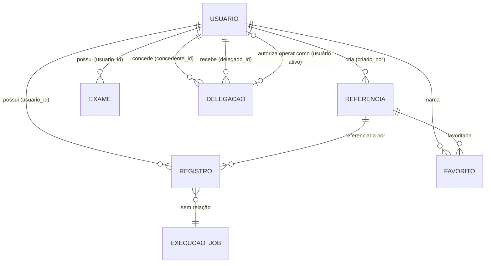

# Domain Model — MeuFenil

**Última verificação:** 2026-09-04 (ENH-0004 — modelo canônico e identidade imutável de referências)

Modelo conceitual reconstruído a partir do sistema atual (banco, código, UI e testes). O modelo descreve conceitos — as tabelas são apenas parte da persistência deles.

## Diagrama conceitual

Nota: `EXECUCAO_JOB` (background_job_executions) é uma entidade isolada do domínio de negócio (sem FK) — aparece no modelo apenas por completude `[CONFIRMED: database]`.

## Entidades

### Usuario

- **Persistência:** `public.usuarios` (FK `id → auth.users(id)` CASCADE) `[CONFIRMED: database]`.
- **Atributos relevantes:** nome, email, `role` (`user`|`admin`), `limite_diario_mg`, `timezone`, `consentimento_lgpd_em` `[CONFIRMED: database]`.
- **Identity:** o `id` É o id do Supabase Auth (não gerado pela aplicação) `[CONFIRMED: database]`.
- **Ownership:** é dono de registros, exames, referências (criadas por ele), favoritos; concede/revoga delegações `[CONFIRMED: database, security]`.
- **Estados:** papel `user` ↔ `admin` (atualizável apenas fora da UI; coluna editável pelo próprio usuário via RLS — fato); consentimento: ausente → presente (data) `[CONFIRMED: database]`.
- **Lifecycle:** criado por trigger no sign-up (limite 500 via default da coluna, role user, timezone America/Sao_Paulo) → atualiza perfil → excluído via edge function (registros → usuarios → auth) ou cascata `[CONFIRMED: migration, code]`.

### Referencia (alimento de referência)

- **Persistência:** `public.referencias` `[CONFIRMED: database]`.
- **Atributos relevantes:** nome (sem sufixo de marca desde a ENH-0004), `marca` (default canônico `'Produto In Natura'` para in natura/sem marca), `fenil_mg_por_100g` (`numeric(10,1)`), `criado_por`, `is_global`, `is_ativa` `[CONFIRMED: database]`.
- **Identidade substantiva:** `(nome, marca, fenil_mg_por_100g)` — única entre referências ATIVAS (índice único parcial com `lower(trim(...))`); arquivadas coexistem com ativas de mesma identidade; para GLOBAIS é imutável por UPDATE (mudança = arquivar + criar nova) `[CONFIRMED: database — referencias.md; code — BR-034]`.
- **Cardinalidades:** Usuario 1—N Referencia; Referencia 1—N Registro; Referencia 1—N Favorito `[CONFIRMED: database]`.
- **Estados:** ativa (default) ↔ arquivada (`is_ativa = false`, soft delete/arquivamento); o arquivamento NÃO remove favoritos (desde a ENH-0004 — sem trigger) e impede novos registros (policy) `[CONFIRMED: database]`.
- **Subtipos observados:** global (`is_global = true`) × pessoal — visibilidade, edição e remoção diferentes: globais têm identidade imutável e nunca são excluídas fisicamente pela aplicação (sempre arquivadas por admin); pessoais são editáveis pelo dono e removíveis (hard apenas sem registros vinculados) `[CONFIRMED: database, security, code — BR-034/BR-037]`.

### Registro (consumo)

- **Persistência:** `public.registros` `[CONFIRMED: database]`.
- **Atributos relevantes:** data, `peso_g`, `fenil_mg` (calculado na UI a partir da referência), referência, usuário `[CONFIRMED: database, code]`.
- **Invariantes:** só pode referenciar referência ATIVA (policy INSERT); sem edição (sem policy UPDATE); exclusão apenas por dono/delegado `[CONFIRMED: database]`.
- **Agregação derivada:** Consumo diário = soma de `fenil_mg` por `data` — base do dashboard, histórico e estatísticas `[CONFIRMED: code]`.

### Exame (PKU)

- **Persistência:** `public.exames_pku` `[CONFIRMED: database]`.
- **Atributos relevantes:** `data_exame` (date), `resultado_mg_dl` (real) `[CONFIRMED: database]`.
- **Derivados:** Tendência = último − penúltimo (ordenado por data) `[CONFIRMED: UI]`.

### Delegacao (de acesso)

- **Persistência:** `public.delegacoes_acesso` `[CONFIRMED: database]`.
- **Atributos relevantes:** concedente, delegado, `created_at`, `revoked_at` `[CONFIRMED: database]`.
- **Invariantes:** no máximo UMA delegação ATIVA por par (índice parcial); revogação = `revoked_at` preenchido (sem DELETE); auto-concessão bloqueada `[CONFIRMED: database, code]`.
- **Estados:** ativa (`revoked_at IS NULL`) ↔ revogada. Reativação: `UNKNOWN` (sem fluxo na aplicação — U-2.4) `[UNKNOWN]`.
- **Conceito derivado:** Usuário Ativo — contexto de sessão da UI que indica em nome de quem a aplicação opera (próprio usuário ou concedente assumido); NÃO altera a identidade real `[CONFIRMED: code, security]`.

### Favorito

- **Persistência:** `public.referencias_favoritas` `[CONFIRMED: database]`.
- **Invariantes:** 1 por par (usuário, referência) (índice único); exige referência visível; PRESERVADO quando a referência é arquivada/desativada (desde a ENH-0004 — o trigger que removia favoritos foi eliminado); removido apenas por desfavoritar ou por cascata na remoção hard (referências pessoais sem registros) `[CONFIRMED: database, migration 20260904000000]`.
- **Comportamento de UI:** favoritos ordenados primeiro no modal de registro `[CONFIRMED: code]`.

### ExecucaoJob (background job)

- **Persistência:** `public.background_job_executions` — entidade de infraestrutura, SEM relação com o domínio de negócio `[CONFIRMED: database]`.
- **Atributos relevantes:** `job_key`, `run_id`, `environment`, `status` (enum), tempos, `message`, `details` `[CONFIRMED: database]`.
- **Lifecycle:** inserida pelo produtor (keepalive) → retida por 365 dias (trigger) → lida por admins `[CONFIRMED: code, migration]`.

## Relacionamentos e cardinalidade (resumo)

| Relação | Cardinalidade | Evidência |
|---|---|---|
| Usuario → Referencia | 1—N (criada por; CASCADE) | FK `criado_por` |
| Usuario → Registro | 1—N (sem CASCADE) | FK `usuario_id` |
| Referencia → Registro | 1—N (sem CASCADE — vínculo impede exclusão hard) | FK `referencia_id` + RPC |
| Usuario → Exame | 1—N (CASCADE) | FK |
| Usuario → Favorito | 1—N (CASCADE) | FK |
| Referencia → Favorito | 1—N (CASCADE) | FK |
| Usuario → Delegação (concedente) | 1—N (CASCADE) | FK |
| Usuario → Delegação (delegado) | 1—N (CASCADE) | FK |
| auth.users → Usuario | 1—1 (CASCADE) | FK `usuarios_id_fkey` |

`[CONFIRMED: database — Fase 2]`

## Ownership (quem é dono do quê)

| Entidade | Dono | Coluna/regra |
|---|---|---|
| Registro, Exame, Favorito | Usuario | `usuario_id = auth.uid()` (+ delegado ativo) |
| Referencia | Usuario criador | `criado_por = auth.uid()` (+ delegado ativo; globais: admin) |
| Delegação | Concedente (gestão) / Delegado (leitura/assunção) | `concedente_id` / `delegado_id` |
| ExecucaoJob | ninguém (infra) | sem coluna de dono |

## Evidências

- E1 — Tabelas/constraints/índices: catálogo (Fase 2) `[CONFIRMED: database]`
- E2 — Políticas e RPCs: `security-model.md` e `database/*.md` `[CONFIRMED: database, migration]`
- E3 — Comportamento de UI: Fase 5 `[CONFIRMED: UI, code]`
- E4 — Fórmulas e agregações: `estatisticas.service.ts:55-73`, `Dashboard.tsx:47-48`, `Exames.tsx:89-97` `[CONFIRMED: code]`

## Veja também

- [business-rules.md](business-rules.md), [../product/glossary.md](../product/glossary.md), [../database/](../database/)
