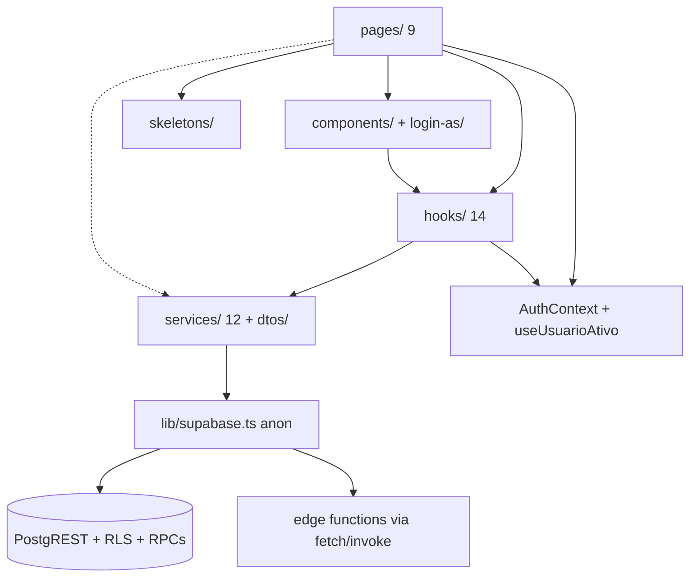

# Frontend — Visão Geral

**Última verificação:** 2026-09-04 (ENH-0004 — lib/referencias.ts do modelo canônico documentada)

## Propósito

Documenta a arquitetura REAL do frontend do MeuFenil (React 19 SPA) — camadas, fluxo de dados, padrões visuais e de interação — para que novas telas possam ser implementadas seguindo os padrões existentes sem redescobrir o sistema.

## Stack e entrypoints

- React 19 + TypeScript strict + Vite 6 + Tailwind 3 + React Router 7 + Recharts + lucide-react + date-fns(-tz) `[CONFIRMED: package.json]`.
- **Bootstrap:** `src/react-app/main.tsx` → `createRoot(...).render(<AuthProvider><App /></AuthProvider>)` — o `AuthProvider` é o ÚNICO provider global `[CONFIRMED: code]`.
- **Router:** `src/react-app/App.tsx` — `BrowserRouter` com 9 rotas declaradas SEM proteção no nível de rota (cada página trata autenticação/autorização) `[CONFIRMED: code]`.
- **Estilos:** Tailwind com configuração PADRÃO (`tailwind.config.js` sem `theme.extend`) — sem tokens customizados; paleta default do Tailwind (indigo/purple predominantes) `[CONFIRMED: configuration]`. CSS próprio mínimo (`index.css`: diretivas + `font-family: Inter, system-ui, ...`) `[CONFIRMED: code]`.

## Arquitetura em camadas

- **pages/ (9)** — composição de componentes + hooks; contém estado de UI local (modais, filtros temporários) `[CONFIRMED: code]`.
- **components/ (6 + 5 login-as)** — reutilizáveis: `Layout`, `AdicionarRegistro`, `ModalReferencia`, `ModalMensagemExecucao`, `ConsentimentoLGPD` + suíte `login-as/` `[CONFIRMED: filesystem]`.
- **hooks/ (14)** — padrão dominante: **1 hook de dados por página**, assinatura `useX(usuarioId?)`, retorno `{ data, loading, error, ações }`; usam `useState/useCallback/useEffect` com `logger.error` em catch (sem exibição de erro ao usuário) `[CONFIRMED: code]`.
- **services/ (12)** — funções `export async function` finas sobre `supabase-js` (anon), mapeando snake_case (DB) → camelCase (DTO); erros via `AppError` com código simbólico + mensagem pt-BR `[CONFIRMED: code — ../backend/overview.md classifica como client-side]`.
- **dtos/ (6)** — interfaces de saída (ver seção DTOs) `[CONFIRMED: filesystem]`.
- **lib/** — `supabase.ts` (client anon), `errors.ts` (`AppError{code, message, cause}`), `logger.ts` (`console.*` com prefixos `[ERROR]/[WARN]/[INFO]`; comentário "futura integração com Sentry" — sem integração real), `app-environment.ts` (`CURRENT_APP_ENVIRONMENT: "prod"|"dev"`), `referencias.ts` (modelo canônico ENH-0004 revisto 2026-09-04: em branco = marca não declarada — `normalizarMarca` (extrai o conteúdo de invólucro `(Marca: X)` e mapeia variantes "não se aplica/in natura" para `''`), `extrairMarcaDoNome`, `nomeComMarca` — testado em `lib/referencias.test.ts` (20 testes)) `[CONFIRMED: code]`.
- **skeletons/** — 14 componentes de loading (`LayoutSkeleton` + `Header/Nav/Footer` + `GenericPageSkeleton` + 8 page skeletons) via alias `@skeletons` `[CONFIRMED: code — skeletons/index.ts]`.

## Rotas (inventário real)

| Path | Página | Proteção | Observação |
|---|---|---|---|
| `/` | Home | redireciona p/ `/dashboard` se autenticado; se loading, spinner | única página SEM Layout |
| `/dashboard` | Dashboard | skeleton se `!ready`; conteúdo depende de `usuarioAtivoId` | |
| `/referencias` | Referencias | skeleton se `!ready` | |
| `/historico` | Historico | skeleton se `!ready \|\| loading` | |
| `/estatisticas` | Estatisticas | skeleton se `!podeBuscar` | |
| `/perfil` | Perfil | skeleton se `!ready \|\| loading` | modo read-only quando delegado |
| `/exames` | Exames | skeleton se `!ready \|\| loading` | |
| `/sobre` | Sobre | skeleton se `!ready` | conteúdo estático |
| `/admin` | Admin | gate duplo: skeleton + box "Acesso Negado" se `perfilUsuario.role !== "admin"` | única página com checagem de papel na UI |

Nenhuma rota tem redirect de não-autenticado explícito (fora `/` → `/dashboard` para autenticados); usuário não autenticado acessando outra rota cai nos estados de loading/`!ready` dos hooks `[CONFIRMED: code — App.tsx + páginas]`. Sem parâmetros de rota; sem rotas aninhadas `[CONFIRMED: code]`.

## Autenticação e autorização na UI (controle de experiência)

- A autorização EFETIVA é do banco (RLS/RPCs) — ver [../security/security-model.md](../security/security-model.md). A UI implementa apenas visibilidade/experiência `[CONFIRMED: security-model]`.
- `AuthContext`: `authUser`, `loadingAuth`, `ready`, `usuarioAtivoId`, `isDelegado`, `owner`, `concedidos/recebidos`, ações de delegação, `signOut` `[CONFIRMED: code — AuthContext.tsx]`.
- `useUsuarioAtivo`: `{ ready, authUserId, usuarioAtivoId, isDelegado, owner }` — usado por páginas para operar sobre o usuário ativo (próprio ou assumido) `[CONFIRMED: code]`.
- Gate de admin na UI: `Layout` inclui item "Admin" na nav apenas se `perfil.role === "admin"`; página Admin repete a checagem com "Acesso Negado" `[CONFIRMED: code]`.
- Delegado (login-as): banner âmbar no header + modo somente-leitura no Perfil (`isReadOnly = isDelegado`); demais páginas operam sobre `usuarioAtivoId` com permissões reais de delegação (banco) `[CONFIRMED: code]`.

## Login-as (UI)

- Assumir: `AcessosRecebidosCard` → `assumir(delegacaoId)` → edge function valida → `sessionStorage["meufenil:login-as"] = {delegacaoId, usuarioAssumidoId, owner}` → estado `loginAs` no AuthContext `[CONFIRMED: code]`.
- Ativo: `LoginAsBanner` (âmbar) exibe "Você está acessando o perfil de <nome>" + botão "Voltar para minha conta" (`sairDoPerfilAssumido` limpa sessionStorage) `[CONFIRMED: code]`.
- Logout real também limpa a sessão login-as `[CONFIRMED: code — AuthContext.tsx:157-162]`.
- Persistência: apenas `sessionStorage` (perde ao fechar aba) `[CONFIRMED: code]`.

## Padrões de dados (hooks → services → DTOs)

- Hook recebe `usuarioId` e monta params; service faz 1+ queries; retorno mapeado para DTO camelCase; `AppError` com código; hook captura e faz `logger.error` (a página normalmente NÃO exibe o erro — ver estados por página) `[CONFIRMED: code]`.
- Cálculo de fenilalanina no CLIENTE: `fenil_mg = (fenil_mg_por_100g * peso_g) / 100` em `AdicionarRegistro.tsx:94-95` e aggregation no cliente em `dashboard.service`/`estatisticas.service` (reduce no browser) `[CONFIRMED: code]`.
- Timezone: dados de data usam `formatInTimeZone(..., usuario.timezone, ...)`; timezone do browser (`Intl.DateTimeFormat().resolvedOptions().timeZone`) apenas como fallback do contexto `[CONFIRMED: code]`.

## DTOs e mapeamento

| Arquivo | Tipos | Padrão observado |
|---|---|---|
| `usuarios.dto.ts` | `UsuarioDTO` | snake_case do DB preservado (limite_diario_mg etc.) |
| `exames.dto.ts` | `ExameDTO` | snake_case preservado |
| `dashboard.dto.ts` | `DashboardHojeDTO`, `DashboardGraficoDTO`, `DashboardUsuarioDTO`, `DashboardDTO` | agregação client-side |
| `estatisticas.dto.ts` | `PeriodoEstatisticas = "semana"\|"mes"`, `EstatisticaRegistroDTO`, `EstatisticasDTO` | agregação client-side |
| `admin.dto.ts` | `UsuarioAdminDTO`, `EstatisticasAdminDTO` | |
| `background-jobs.dto.ts` | `BackgroundJobStatus`, `BackgroundJobEnvironment = "prod"\|"dev"`, DTOs de execução/overview/filtros | |

Padrão real: DTOs simples com campos snake_case espelhando o DB (não há camada de mapper formal; o mapeamento é inline nos services com `any` em joins) `[CONFIRMED: code — services/*.service.ts]`. NÃO existe arquitetura de DTO/mapper além disso `[CONFIRMED: ausência]`.

## Padrões visuais observados (não há design system formal)

`[CONFIRMED: code — classes recorrentes em páginas/componentes]`

- **Fundo de páginas logadas:** `min-h-screen flex flex-col bg-gradient-to-br from-blue-50 via-indigo-50 to-purple-50` (Layout).
- **Cards de conteúdo:** `bg-white/80 backdrop-blur-sm rounded-2xl p-4 sm:p-6 shadow-lg`; card de lista com `overflow-hidden`.
- **Header de página:** `h1 text-xl sm:text-2xl md:text-3xl font-bold text-gray-900` + subtítulo `text-gray-600`.
- **Botão primário:** `bg-gradient-to-r from-indigo-600 to-purple-600 text-white px-6 py-3 rounded-xl font-semibold shadow-lg hover:shadow-xl transition-all` (+ `transform hover:-translate-y-0.5` em CTAs); `disabled:opacity-50 disabled:cursor-not-allowed`.
- **Botão secundário:** `bg-white border(-2) border-gray-300(-indigo-600) text-gray-700(-indigo-600) rounded-xl font-semibold hover:bg-gray-50`.
- **Inputs:** `w-full px-4 py-3 rounded-xl border border-gray-300 focus:ring-2 focus:ring-indigo-500 focus:border-transparent`; labels `text-sm font-medium text-gray-700`; `accent-indigo-600` em checkboxes.
- **Ícones em caixa:** `w-11/12 h-11/12 bg-<cor>-100 rounded-xl` + ícone `text-<cor>-600` (blue/green/purple/indigo/cyan/teal).
- **Números:** `toFixed(1)` para valores em mg, `text-2xl sm:text-3xl font-bold`; cores semânticas verde/vermelho/âmbar por estado.
- **Modais:** overlay `fixed inset-0 bg-black/50 backdrop-blur-sm flex items-end sm:items-center justify-center z-50 p-0 sm:p-4`; painel `bg-white rounded-t-2xl sm:rounded-2xl shadow-2xl w-full max-w-* max-h-[92vh] overflow-y-auto` (bottom-sheet mobile / central desktop); fechar por botão X ("w-10 h-10 ... hover:bg-gray-100") ou "Cancelar" — SEM fechar por ESC/overlay `[CONFIRMED: ausência]`.
- **Alertas/erros:** `bg-red-50 border-l-4 border-red-500 rounded-xl p-4`; aviso âmbar/azul análogos (`border-yellow-200`/`border-blue-500`).
- **Gráficos (Recharts):** grid `strokeDasharray="3 3" stroke="#e5e7eb"`; eixos `stroke="#6b7280"`; tooltip branco translúcido `rgba(255,255,255,0.95)`, `borderRadius 12px`, shadow; gradiente `#6366f1 → #9333ea` (indigo→purple) com `id="colorGradient"`; labels dd/MM ou dd 'de' MMMM pt-BR; altura `h-56 sm:h-64` ou `h-64 sm:h-80` `[CONFIRMED: code — Dashboard.tsx:183-217, Estatisticas.tsx:183-217, Exames.tsx:192-221]`.
- **Tabelas:** `hidden md:block overflow-x-auto` + versão mobile `md:hidden` em cards; `thead bg-gray-50` com `text-xs font-medium text-gray-500 uppercase tracking-wider` `[CONFIRMED: code — Exames.tsx:247-295, Referencias/Admin]`.
- **Skeleton:** `LayoutSkeleton` + `<Pagina>Skeleton` substituindo a página inteira (`animate-pulse`) durante carga inicial; cargas posteriores com overlay/spinner (Referencias) ou spinner no botão (Admin) `[CONFIRMED: code]`.
- **Confirmations:** `confirm()`/`prompt()` nativos do browser (textos exatos nas specs de página) `[CONFIRMED: code]`.
- **Feedback de sucesso:** `alert()` nativo `[CONFIRMED: code]`.
- **Icones:** lucide-react (24px default, classes w-4/5/6 h-4/5/6) `[CONFIRMED: code]`.

## Responsividade (breakpoints observados)

Usa apenas breakpoints default do Tailwind; padrões recorrentes: colunas `grid-cols-1 sm:grid-cols-2 md:grid-cols-3`; navegação `grid-cols-4 md:flex`; tabela desktop `hidden md:block` × cards mobile `md:hidden`; modais bottom-sheet mobile × centralizado `sm:`; textos `text-xl sm:text-2xl md:text-3xl` `[CONFIRMED: code]`. Não há breakpoints customizados `[CONFIRMED: configuration — tailwind.config.js]`.

## Acessibilidade (práticas realmente existentes)

- Labels visíveis em inputs (`<label>`) e `required` nativo `[CONFIRMED: code]`.
- HTML semântico: `table/thead/th/tbody`, `dl/dt/dd` (Admin), `section`, hierarquia h1–h5, `nav` `[CONFIRMED: code]`.
- `title` em botões de ícone (paginação, limpar busca, badges) `[CONFIRMED: code]`.
- Estados `disabled` com feedback visual `[CONFIRMED: code]`.
- **Não existe:** `role=`, focus trap em modais, teclado customizado (exceto ESC para fechar dropdown em AdicionarRegistro) `[CONFIRMED: ausência — grep 2026-08-13]`. Único `aria-*` do app: `aria-label="Fechar"` no `ModalMensagemExecucao` (ENH-0003, 2026-08-27) `[CONFIRMED: code]`. Sem declaração de conformidade WCAG `[CONFIRMED: ausência]`.

## PWA

- `public/manifest.json`: `display: standalone`, `orientation: portrait-primary`, theme/background `#6366f1`/`#ffffff`, ícones 192/512/maskable, `lang: pt-BR`, categorias health/medical/lifestyle `[CONFIRMED: configuration]`.
- `index.html`: `link rel=manifest`, `theme-color #6366f1`, apple-touch-icon, favicon, metas OG/Twitter `[CONFIRMED: code]`.
- **NÃO existe service worker** no repositório (sem cache/offline implementados no código) `[CONFIRMED: ausência — filesystem]`. Vercel pode gerar comportamento de plataforma — não verificável (`UNKNOWN`).

## Testes de frontend

Localização colocalizada; componentes/hooks/services testados; 4 de 9 páginas com teste próprio (Admin, Perfil, Referencias, Dashboard — TEST-0001) e 2 componentes (AdicionarRegistro, ConsentimentoLGPD):

| Grupo | Testes |
|---|---|
| services | 12 arquivos `*.service.test.ts` |
| hooks | 12 arquivos `use*.test.ts(x)` (todos os hooks de dados têm teste) |
| páginas | `Admin.test.tsx`, `Perfil.test.tsx`, `Referencias.test.tsx`, `Dashboard.test.tsx` (Estatisticas, Exames, Historico, Home, Sobre sem teste próprio) |
| componentes | `AdicionarRegistro.test.tsx`, `ConsentimentoLGPD.test.tsx` |
| context | sem teste identificado `[CONFIRMED: ausência]` |

Avaliação de suficiência: Fase 6.

## Evidências

- E1 — Entrypoints e rotas: `src/react-app/main.tsx`, `src/react-app/App.tsx` `[CONFIRMED: code]`
- E2 — Camadas e inventários: filesystem + grep de hooks/services/DTOs/skeletons (2026-08-13) `[CONFIRMED: code]`
- E3 — Padrões visuais: classes recorrentes nas páginas/componentes `[CONFIRMED: code]`
- E4 — Configurações: `tailwind.config.js`, `index.css`, `public/manifest.json`, `index.html` `[CONFIRMED: configuration]`
- E5 — Ausências: sem service worker, sem `aria-*`/`role=` (grep), sem tokens customizados `[CONFIRMED: ausência]`

## Veja também

- `pages/` e `components/` (specs individuais)
- [../backend/overview.md](../backend/overview.md) (frontend × backend), [../security/security-model.md](../security/security-model.md) (auth/UI authorization), [../database/](../database/) (tabelas consumidas)
- [../system-map.md](../system-map.md)
