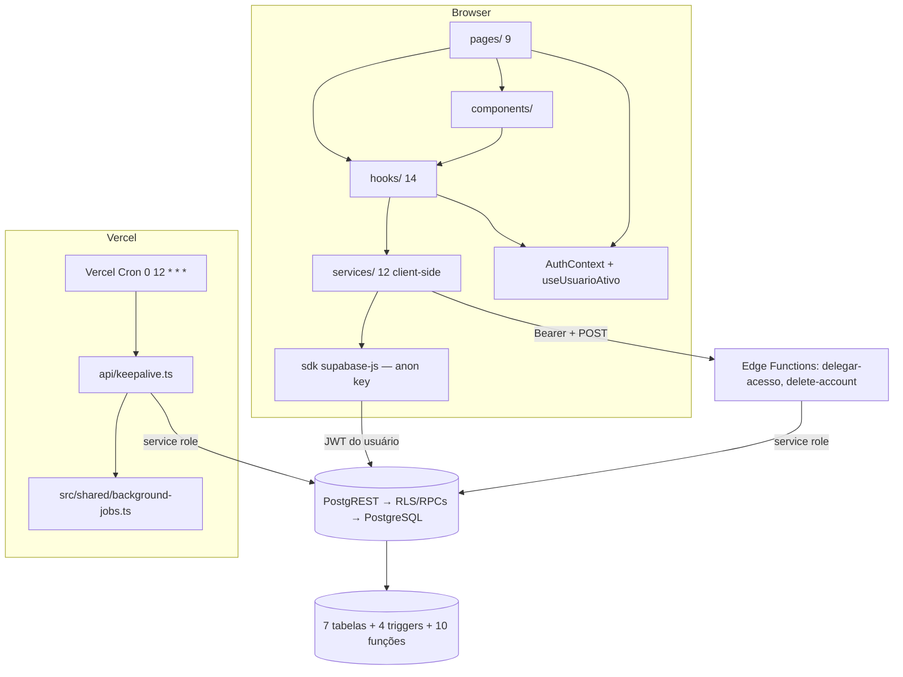

# Arquitetura do MeuFenil

Visão arquitetural do **MeuFenil**: uma SPA sem servidor de aplicação próprio, composta por frontend (React/Vite), backend distribuído (Supabase: Postgres/RLS/RPC + Auth + Edge Functions) e uma função serverless na Vercel (keepalive). (Fonte: `architecture/overview.md`)

## Sumário

- [Visão geral](#visao-geral)
- [Diagrama de camadas](#diagrama-de-camadas)
- [Frontend (React/Vite)](#frontend-reactvite)
- [Supabase (Postgres + Auth + Edge Functions)](#supabase-postgres--auth--edge-functions)
- [Vercel (keepalive)](#vercel-keepalive)
- [Fluxos de dados](#fluxos-de-dados)
- [Autenticação e autorização](#autenticacao-e-autorizacao)
- [Fronteiras de execução (runtime boundaries)](#fronteiras-de-execucao-runtime-boundaries)
- [Decisões arquiteturais (ADRs)](#decisoes-arquiteturais-adrs)

## Visão geral

- **SPA React 19 + TypeScript strict + Vite + Tailwind**, com React Router 7, Recharts, lucide-react e date-fns(-tz). (Fonte: `frontend/overview.md`)
- **Supabase como BaaS:** autenticação (Google OAuth), PostgREST (consultas com RLS), RPCs de negócio e 2 Edge Functions (Deno). (Fonte: `architecture/overview.md`, `backend/overview.md`)
- **Vercel:** hospedagem da SPA + função `api/keepalive` acionada por cron diário (`0 12 * * *` UTC) para evitar pausa do plano gratuito do Supabase. (Fonte: `backend/api-keepalive.md`)
- **Ferramentas locais:** CLI de gestão (`scripts/cli/`) e script de migrations (`scripts/apply-supabase-migrations.sh`). (Fonte: `backend/cli.md`)
- **Banco:** PostgreSQL com 7 tabelas, RLS em todas, 31 políticas, 10 funções e 4 triggers. (Fonte: `database/overview.md`)

## Diagrama de camadas

Todas as arestas são confirmadas por código/configuração. (Fonte: `architecture/overview.md` — diagrama validado nas Fases 4–5)

## Frontend (React/Vite)

- **Camadas internas:** `pages → hooks → services → lib/supabase`; 1 hook de dados por página (`useX(usuarioId?)` retornando `{ data, loading, error, ações }`); services client-side com DTOs espelhando snake_case; erros `AppError` + `logger`; loading por skeletons. (Fonte: `frontend/overview.md`)
- **9 rotas** (`/`, `/dashboard`, `/referencias`, `/historico`, `/estatisticas`, `/perfil`, `/exames`, `/sobre`, `/admin`) sem proteção no nível de rota — cada página trata autenticação via `AuthContext`/`useUsuarioAtivo`. (Fonte: `frontend/overview.md` — tabela de rotas)
- **PWA:** `public/manifest.json` (standalone, tema `#6366f1`, ícones 192/512/maskable) — instalável, porém **sem service worker/offline**. (Fonte: FEAT-0014 - PWA; `frontend/overview.md`)
- **Autorização de UI é controle de experiência** — o enforcement é do banco. (Fonte: `security/security-model.md` seção 2)

## Supabase (Postgres + Auth + Edge Functions)

### Banco de dados (Postgres + PostgREST)

- **7 tabelas:** `usuarios`, `referencias`, `registros`, `exames_pku`, `referencias_favoritas`, `delegacoes_acesso`, `background_job_executions`. (Fonte: `database/overview.md`)
- **RLS habilitado em todas** com 31 políticas; grants amplos — o RLS é a fronteira de autorização efetiva (ADR-0004). (Fonte: `security/security-model.md` seção 8)
- **10 funções (RPCs):** negócio (`ativar_referencia`, `remover_ou_desativar_referencia`), admin (`get_estatisticas_admin`), apoio (`is_admin_user`), consulta (`dashboard_hoje`/`dashboard_ultimos_dias` — sem chamadores) e 4 funções de trigger. (Fonte: `database/rpc.md`)
- **4 triggers:** normalização de nome de referência, limpeza de favoritos de referência inativa, retenção de jobs (365 dias) e criação de perfil no sign-up (`on_auth_user_created`). (Fonte: `database/triggers.md`)

### Auth (Supabase Auth)

- **Google OAuth:** `signInWithOAuth({ provider: "google", redirectTo: /dashboard })`; a identidade de todas as policies é `auth.uid()`. (Fonte: `security/security-model.md` seção 1; verificado em: `src/react-app/hooks/useUser.ts`)
- **Perfil criado por trigger** (`handle_new_user`) no primeiro acesso, com `role = 'user'`, timezone `America/Sao_Paulo` e limite diário 500 mg (default da coluna). (Fonte: FEAT-0001 - Autenticação; `database/triggers.md`)

### Edge Functions (Deno)

| Função | Papel | Acesso privilegiado |
|---|---|---|
| `delegar-acesso` | conceder/revogar/assumir delegações (login-as) | service role + validação do Bearer |
| `delete-account` | exclusão de conta (registros → usuarios → auth) | service role + validação do Bearer (`verify_jwt = true`) |

(Fonte: `backend/overview.md` — inventário; `backend/edge-function-delegar-acesso.md`, `backend/edge-function-delete-account.md`)

## Vercel (keepalive)

- **`api/keepalive.ts`** (serverless Node) é o único componente server-side próprio. (Fonte: `architecture/overview.md`)
- **Cron:** `0 12 * * *` UTC (≈09:00 em `America/Sao_Paulo` no horário normal). (Fonte: `backend/api-keepalive.md`; verificado em: `vercel.json`)
- **Fluxo:** resolve o ambiente por `VERCEL_ENV` (production → prod; senão dev) → ping `SELECT id FROM usuarios LIMIT 1` com **service role** (um alvo por execução) → persiste a execução em `background_job_executions` via `src/shared/background-jobs.ts` (`job_key = "keepalive"`, status success/failure, tempos, details). (Fonte: `backend/api-keepalive.md`; verificado em: `api/keepalive.ts`)
- **Retenção:** trigger remove execuções com mais de 365 dias a cada INSERT. (Fonte: `database/triggers.md`)

## Fluxos de dados

| Fluxo | Caminho | Fonte |
|---|---|---|
| Autenticação | Browser → Supabase Auth (OAuth Google) → trigger cria perfil em `usuarios` | FEAT-0001; `architecture/overview.md` |
| Registro de consumo | UI calcula fenilalanina → PostgREST INSERT (RLS dono/delegado + referência ativa) | FEAT-0003; `database/registros.md` |
| Referências | UI → PostgREST (CRUD) / RPCs `ativar_referencia` e `remover_ou_desativar_referencia` | FEAT-0008; `database/rpc.md` |
| Exames PKU | UI → PostgREST (RLS dono/delegado) | FEAT-0009; `database/exames_pku.md` |
| Delegação (login-as) | UI → edge function `delegar-acesso` (Bearer + service role) → `delegacoes_acesso`; autorização por RLS | FEAT-0011; `security/security-model.md` seção 9 |
| Painel admin | UI → PostgREST/RPC `get_estatisticas_admin` | FEAT-0012; `database/rpc.md` |
| Keepalive | Vercel Cron → service role → ping + persistência em `background_job_executions` | FEAT-0013; `backend/api-keepalive.md` |
| Exclusão de conta | UI → edge function `delete-account` (registros → usuarios → auth) | FEAT-0010; `backend/edge-function-delete-account.md` |

## Autenticação e autorização

- **Autenticação:** Google OAuth via Supabase Auth; sessão gerenciada pelo SDK (`getSession()` + `onAuthStateChange`); identidade = `auth.uid()`. (Fonte: `security/security-model.md` seção 1)
- **Autorização (modelo RLS):** papéis `user`/`admin` em `usuarios.role`; ownership por coluna de dono; delegação via `delegacoes_acesso` ativa (`revoked_at IS NULL`) consumida por 15 policies e 2 RPCs; admin via `is_admin_user` (ou claim JWT em policies de `referencias`). (Fonte: `security/security-model.md` seções 1–3)
- **Login-as NÃO troca token:** "assumir perfil" é estado de UI em `sessionStorage` (`meufenil:login-as`); a autorização do usuário assumido é exercida pelas policies/RPCs via `delegacoes_acesso` — sem impersonação de JWT (ADR-0005). (Fonte: `security/security-model.md` seção 1; `backend/edge-function-delegar-acesso.md`)
- **RPCs sensíveis:** `SECURITY DEFINER` com verificação interna dono/delegado/admin (ADR-0010). (Fonte: `database/rpc.md`; `security/security-model.md` seção 10)
- **Service role:** bypass de RLS somente server-side (edge functions e keepalive); a chave nunca fica no bundle do browser. (Fonte: `architecture/overview.md` — runtime boundaries; `security/secrets-and-environments.md`)

## Fronteiras de execução (runtime boundaries)

| Fronteira | Natureza | Enforcement |
|---|---|---|
| Browser × servidor | sem app server — tudo server-side é BaaS/edge | — |
| Não autenticado × autenticado | RLS (anon vê só referências globais) | banco |
| Usuário × Admin | `usuarios.role` + `is_admin_user`/claim JWT | banco + gate de UI |
| Dono × Delegado | `delegacoes_acesso` ativa | banco (15 policies + 2 RPCs) |
| anon/authenticated × service_role | bypass de RLS apenas server-side | segredo service role fora do browser |
| Supabase × Vercel | keepalive Vercel → Supabase via service role | envs Vercel |
| DEV × PROD | bancos distintos; keepalive por ambiente; labels `dev`/`prod` | envs |

(Fonte: `architecture/overview.md` — runtime boundaries)

## Decisões arquiteturais (ADRs)

As decisões formais estão em `.ai/specs/decisions/` (Fonte: `architecture/overview.md` — índice arquitetural):

| ADR | Decisão |
|---|---|
| ADR-0001 / ADR-0008 | Supabase como BaaS; sem servidor de aplicação próprio |
| ADR-0002 | SPA React + Vite + Tailwind |
| ADR-0003 | Google OAuth |
| ADR-0004 | RLS como enforcement de autorização |
| ADR-0005 | Delegação login-as sem troca de token |
| ADR-0006 | Soft delete de referências via `is_ativa` |
| ADR-0007 | Keepalive cron com persistência própria |
| ADR-0009 | Migrations via Supabase CLI |
| ADR-0010 | RPCs SECURITY DEFINER para operações sensíveis |
| ADR-0011 | Testes de segurança com autenticação real (Abordagem B) |
| ADR-0012 | Spec-driven + operações GitHub (Spec → Issue → PR → Release) |

**Padrões observados** (sem ADR formal): camadas hooks→services no frontend; soft delete via coluna de estado; background job com persistência própria. (Fonte: `architecture/overview.md` — architectural patterns)
